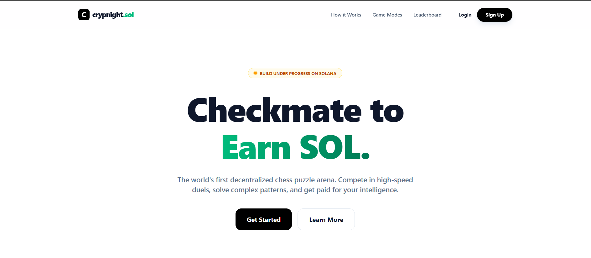

# ♟️ CrypNight.sol

**Web3 Chess Skill-to-Earn Platform on Solana**



Players solve chess puzzles and earn SOL rewards. No gambling, no randomness — only skill.

---

## 🎮 How It Works

1. Sign up with email + connect Phantom wallet
2. Choose skill tier (Beginner → Grandmaster)
3. Solve 10-puzzle speed runs
4. Earn SOL rewards instantly on-chain
5. Climb the leaderboard

---

## ⚡ Features

- **Solo Speed Mode** — Timed puzzle runs with adaptive difficulty
- **Instant Payouts** — On-chain rewards via Solana smart contracts
- **Anti-Cheat** — Server-side validation, move verification, solve-time anomaly detection
- **ELO Rating** — Adaptive per-puzzle rankings
- **Global Leaderboard** — Ranked by tier with sockpuppet filtering

---

## 🧱 Tech Stack

- **Frontend:** React + Vite
- **Backend:** Node.js + Express
- **Database:** Supabase (PostgreSQL)
- **Blockchain:** Solana + Anchor Framework
  - **Smart Contract:** Deploy your contract on devnet and add address here (see `crypnight-contracts/README.md`)
- **Game Logic:** Magic Block ER (Ephemeral Rollups)

---

## 📁 Repo Layout

```
crypnight.sol/
├── frontend/          # React UI (Vite)
├── backend/           # Express API + payout logic
├── crypnight-contracts/  # Anchor smart contracts
├── docs/              # Phase documentation
└── PROJECT_ANALYSIS.md   # Full architecture guide
```

---

## 🚀 How to Run

**Backend:**
```bash
cd backend
npm install
# Add .env (see backend/.env.example)
node index.js
```

**Frontend:**
```bash
cd frontend
npm install
npm run dev
```

**Smart Contract (optional):**
```bash
cd crypnight-contracts
anchor build
anchor deploy --provider.cluster devnet
```

---

